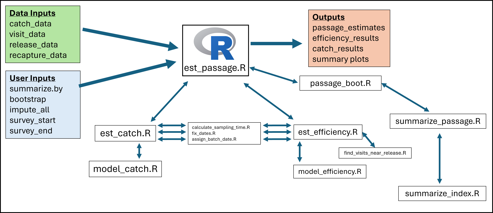
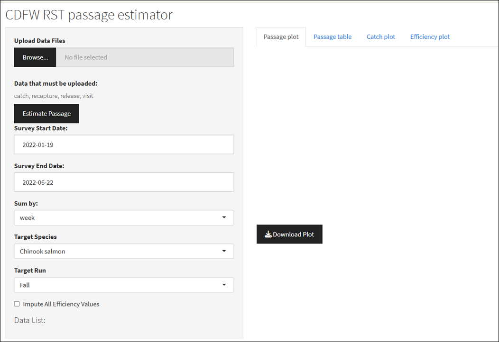
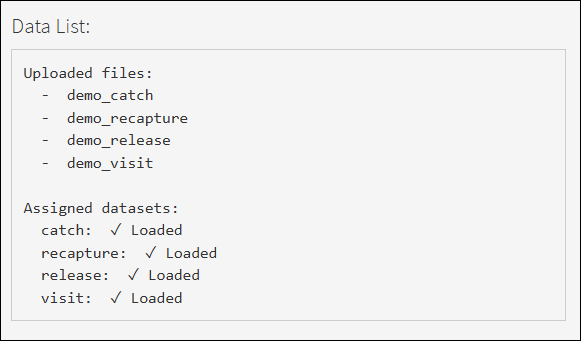
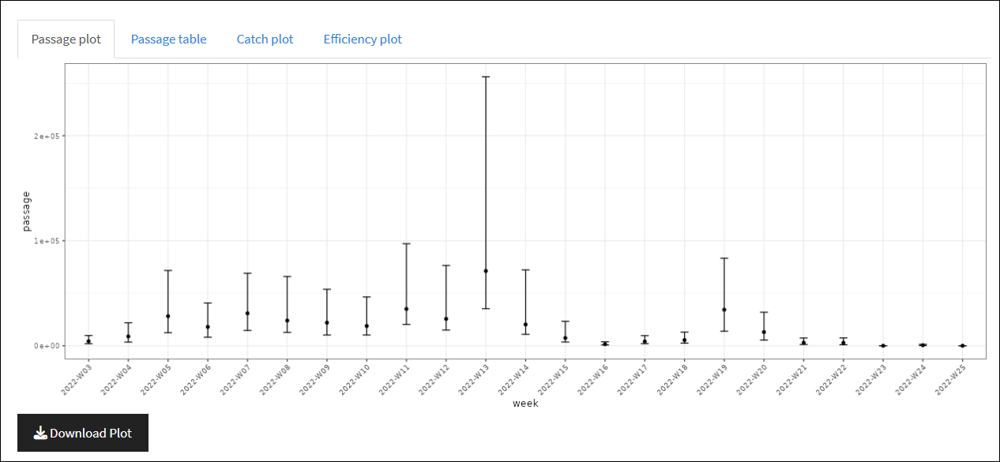
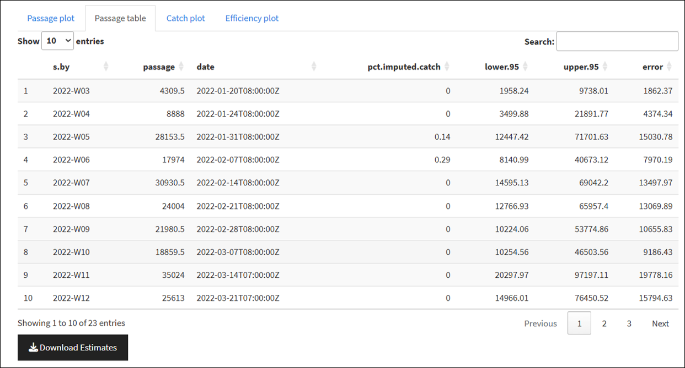
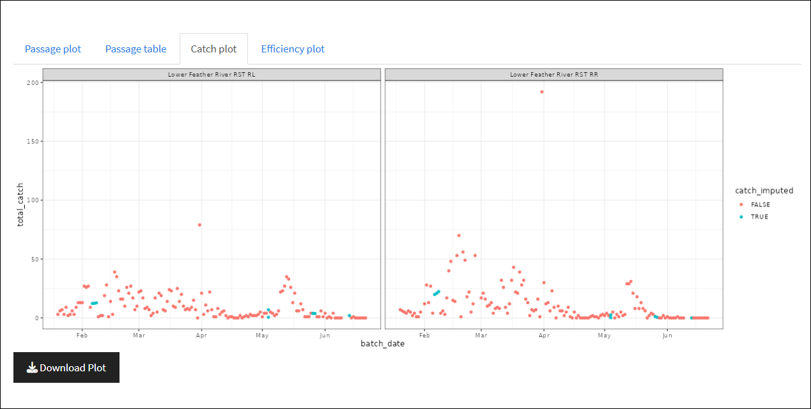
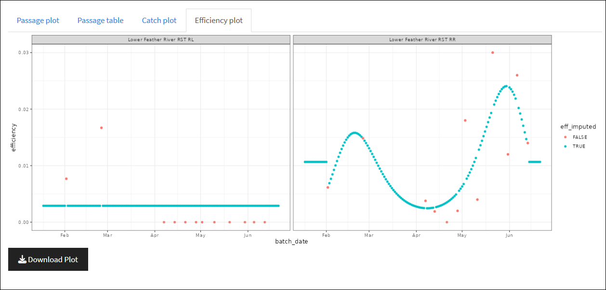

## Summary

The `RST_app.R` Shiny application estimates juvenile salmonid out-migration passage (abundance) using rotary screw trap data submitted by the user. This application aims to replicate passage calculation and imputation methods utilized in the CAMP Rotary Screw Trap (CAMPR) platform but in a standalone, user friendly , documented, and replicable online platform. The CAMPR platform was created by Trent McDonald to support CDFW salmonid monitoring efforts in the Central Valley and allows direct connection between the modeling software built in R and the monitoring Access database. While CAMPR provides a usable system to simplify complex model fitting and passage estimation, it is currently a "black-box" back end with undetailed documentation and is no longer maintained or updated.

The `RST_app.R` is a standalone package and RShiny application that performs model fitting and passage estimation in a web-based platform that requires no Access database or R experience to operate. While it does not require database connectivity, users do need to ensure their data is pre-formatted for use with the application. This document also aims to be a detailed overview of use, methodology, and the relevant scripts and functions that are used by the application. This application is also owned and maintained by CDFW staff, which allows for future maintenance and updates as needed.

@fig-data_flow shows an overview of how data and user inputs are utilized by the different functions in the `RST_app` to produce estimates of passage, efficiency, catch, and related summary plots. Users need to upload .csv files of `catch_data`, `visit_data`, `release_data`, and `recapture_data` to the application. Then users can either set or use default input values to determine how passage data is summarized, whether or not to impute all or efficiency values, and the start and end dates for the survey period. These inputs are passed to the `est_passage.R` function, which then utilizes several downstream functions to produce estimates of passage and related uncertainty. The data inputs and relevant functions are covered in more detail in the following sections of this methods documentation.

{#fig-data_flow}

Code, documentation, and example data for the `RST_app` can be found at: <https://github.com/arthurbarros-CDFW/RST_app>.

## RST_app User Guide

The `RST_app` is hosted and can be accessed by users at <https://arthurbarros-cdfw.shinyapps.io/RST_app/>. The application is currently hosted on a free account using the shinyapps.io platform which limits usage hours per month, but I aim to have it hosted on a paid account to alleviate that in the future. To use the `RST_app` users need to have four datasets in a specific .csv file format. Structuring the application to allow for data inputs in different formats would be inefficient and make it unwieldy. It is instead simpler to construct the application to intake data in a specific format to ensure compatibility, so the onus is on the user to ensure proper their data is in the proper structure.

### *Data formatting*

The user is required to input data from four .csv tables:

- catch - records of fish caught during each trap visit.

- visit - records of all trap operation and sampling events.

- release - records of fish marked and released for efficiency trials.

- recapture - records of marked fish recaptured for efficiency trials.

When uploading the four .csv files, the `app.R` script looks for the keywords "catch", "visit", "release", and "recapture" in the file names, and assigns the files to relevant data set variable names, so if users ensure those keywords are in the appropriate file name, the application will assign the data properly for use in relevant functions.

For examples of how to structure the input data, see <https://github.com/arthurbarros-CDFW/RST_app/tree/main/data/test_data>. Below I detail which fields are required within the tables for the application to function properly. Tables can include additional data, and additional fields may be useful in the future as the applications functionality is updated.

**`catch.csv`** needs to be set in the following structure:

+----------------+---------------------+--------------------------------------------------------------------------------------------------+----------------+
| Field          | Type                | Description                                                                                      | Required (Y/N) |
+================+=====================+==================================================================================================+================+
| site_name      | text                | Name of river/study site                                                                         | Y              |
+----------------+---------------------+--------------------------------------------------------------------------------------------------+----------------+
| subsite_name   | text                | Trap location identifier used when multiple traps at a site. Still use if only one trap at site. | Y              |
+----------------+---------------------+--------------------------------------------------------------------------------------------------+----------------+
| visit_time     | datetime (ISO 8601) | Date and time when trap was visited and catch recorded.                                          | Y              |
|                |                     |                                                                                                  |                |
|                |                     | YYYY-MM-DDThh:mm:ss                                                                              |                |
+----------------+---------------------+--------------------------------------------------------------------------------------------------+----------------+
| common_name    | text                | Species common name, currently only used for "Chinook salmon".                                   | Y              |
+----------------+---------------------+--------------------------------------------------------------------------------------------------+----------------+
| at_capture_run | text                | Run timing, currently only used for "Fall".                                                      | N              |
+----------------+---------------------+--------------------------------------------------------------------------------------------------+----------------+
| n              | integer             | Number of fish captured by trap and recorded during visit.                                       | Y              |
+----------------+---------------------+--------------------------------------------------------------------------------------------------+----------------+

**`visit.csv`** needs to be structured in the following format:

+----------------+---------------------+--------------------------------------------------------------------------------------------------+----------------+
| Field          | Type                | Description                                                                                      | Required (Y/N) |
+================+=====================+==================================================================================================+================+
| site_name      | text                | Name of river/study site                                                                         | Y              |
+----------------+---------------------+--------------------------------------------------------------------------------------------------+----------------+
| subsite_name   | text                | Trap location identifier used when multiple traps at a site. Still use if only one trap at site. | Y              |
+----------------+---------------------+--------------------------------------------------------------------------------------------------+----------------+
| visit_time     | datetime (ISO 8601) | Date and time when trap was visited and catch recorded.                                          | Y              |
|                |                     |                                                                                                  |                |
|                |                     | YYYY-MM-DDThh:mm:ss                                                                              |                |
+----------------+---------------------+--------------------------------------------------------------------------------------------------+----------------+
| trap_visit_ID  | text/integer        | Unique identifier for each visit                                                                 | Y              |
+----------------+---------------------+--------------------------------------------------------------------------------------------------+----------------+
| visit_type     | text                | See valid values below                                                                           | Y              |
+----------------+---------------------+--------------------------------------------------------------------------------------------------+----------------+
| fish_processed | text                | Processing status                                                                                | Y              |
+----------------+---------------------+--------------------------------------------------------------------------------------------------+----------------+
| include_catch  | text                | "Yes" or "No"                                                                                    | Y              |
+----------------+---------------------+--------------------------------------------------------------------------------------------------+----------------+

Valid `visit_type` values are:

- `"Start trap & begin trapping"`

- `"Continue trapping"`

- `"End trapping"`

- `"Unplanned Restart"`

Valid `fish_processed` values are:

- `"N/A; not a sampling visit"`

- `"Processed fish"`

- `"No fish were caught"`

- `"No catch data; fish released"`

**`release.csv`** needs to be structured in the following format:

+------------------+---------------------+--------------------------------------------------------------------------------------------------+----------------+
| Field            | Type                | Description                                                                                      | Required (Y/N) |
+==================+=====================+==================================================================================================+================+
| site_name        | text                | Name of river/study site                                                                         | Y              |
+------------------+---------------------+--------------------------------------------------------------------------------------------------+----------------+
| subsite_name     | text                | Trap location identifier used when multiple traps at a site. Still use if only one trap at site. | Y              |
+------------------+---------------------+--------------------------------------------------------------------------------------------------+----------------+
| release_time     | datetime (ISO 8601) | Date and time when release occurred                                                              | Y              |
|                  |                     |                                                                                                  |                |
|                  |                     | YYYY-MM-DDThh:mm:ss                                                                              |                |
+------------------+---------------------+--------------------------------------------------------------------------------------------------+----------------+
| release_ID       | text/integer        | Unique identifier for release event                                                              | Y              |
+------------------+---------------------+--------------------------------------------------------------------------------------------------+----------------+
| include_analysis | text                | "Yes" or "No" used to indicate if data should be used for efficiency estimation                  | Y              |
+------------------+---------------------+--------------------------------------------------------------------------------------------------+----------------+
| n_released       | integer             | Number of fish released                                                                          | Y              |
+------------------+---------------------+--------------------------------------------------------------------------------------------------+----------------+

**`recapture.csv`** needs to be structured in the following format:

+---------------+---------------------+--------------------------------------------------------------------------------------------------+----------+
| Field         | Type                | Description                                                                                      | Required |
+===============+=====================+==================================================================================================+==========+
| site_name     | text                | Name of river/study site                                                                         | Y        |
+---------------+---------------------+--------------------------------------------------------------------------------------------------+----------+
| subsite_name  | text                | Trap location identifier used when multiple traps at a site. Still use if only one trap at site. | Y        |
+---------------+---------------------+--------------------------------------------------------------------------------------------------+----------+
| visit_time    | datetime (ISO 8601) | Date and time when recapture occurred                                                            | Y        |
|               |                     |                                                                                                  |          |
|               |                     | YYYY-MM-DDThh:mm:ss                                                                              |          |
+---------------+---------------------+--------------------------------------------------------------------------------------------------+----------+
| trap_visit_ID | text/integer        | Links recapture data to visit record                                                             | Y        |
+---------------+---------------------+--------------------------------------------------------------------------------------------------+----------+
| release_ID    | text/integer        | Links recapture data to release record                                                           | Y        |
+---------------+---------------------+--------------------------------------------------------------------------------------------------+----------+
| n             | integer             | Number of recaptured fish                                                                        | Y        |
+---------------+---------------------+--------------------------------------------------------------------------------------------------+----------+

It is important the user ensures they have the four required data tables available and in the above format in order to properly use the `RST_app`.

#### *Inputs*

Once the four necessary data sets are properly formatted the user can utilize the load the RST_app found at <https://arthurbarros-cdfw.shinyapps.io/RST_app/>. The application main screen has all input fields on the left side (@fig-user_inputs) that allows users to upload their data, set the survey period, target species, and other variables.

{#fig-user_inputs}

Users should set the following when using the application:

- **Upload data files:** Use this field to browse to the necessary RST data files (see Data formatting above) and load the files. Multiple files can be selected and uploaded at once. When the necessary data sets are properly loaded, and if they are properly named, they will be displayed at the bottom in the "Data List" (@fig-data_list).

- **Survey Start and End Date:** Date fields that set the start and end for the time period in which passage estimates are needed. This allows users to upload many years of data, but specifiy a certain time period for estimates.

- **Sum by:** Time grouping variable to summarize passage data by. Defaults to week.

- **Target Species:** Allows user to set species of interest, currently limited to Chinook Salmon, planned to be expanded upon in the future.

- **Target Run:** Allows user to set run of interest, currently limited to Fall, planned to be expanded upon in the future.

- **Impute All Efficiency Values:** Allows user to determine whether or not to impute all efficiency values, even those observed via efficiency trials.

{#fig-data_list}

Once the data sets are uploaded and the inputs set, click the "Estimate Passage" button to run the models and produce the passage estimates and other outputs.

#### *Outputs*

After the data is uploaded and the Estimate Passage models are run, the application produces the following outputs:

- **Passage plot:** displays estimates of out-migrant passage and uncertainty summed by the time grouping variable (defaults to week).

{#fig-passage_plot}

- **Passage table:**  An output table that shows out-migrant passage estimate and uncertainty summed by the time grouping variable. Also includes the field "pct.imputed.catch" which tells what proportion of catch records for the time grouping time period was imputed using catch models.

{#fig-passage_table}

- **Catch plot:** plot showing records of catch for each rotary screw trap for period of record. Displays both recorded catch (in red) and imputed catch (in blue). Note: this should be updated to include shape as a signifier for accessibility.

{#fig-catch_plot}

- **Efficiency plot:** displays plot of efficiency estimates for each rotary screw trap for period of survey. Displays estimates of efficiency derived from actual tests (in red) and imputed efficiency (in blue).

{#fig-efficiency_plot}

Each of the outputs above can be downloaded with the associated "Download" button.

## Functions Overview

The following is an overview of all the functions utilized with in the RST_app application. The code for the functions themselves can be found on the GitHub, but below I provide brief descriptions of each function, what it is used for, as well as the inputs and outputs.

### *global_vars.R*

Defines default variables used across all functions.

**Parameters:**

- gap_threshold_days: Sequential days of a sampling gap that define a new trapping segment (default: 7).

- time_zone: Timezone for date handling (default: America/Los_Angeles).

- unassd.sig.digit: Decimal handling for AIC correction in model selection (1 = use Nemes 2007 correction).

- knotMesh: Minimum data points per spline degree of freedom (default: 15).

- max.ok.gap: Maximum gap (hours) that can be ignored without imputation (default: 2).

- boostrap.CI.fx: Function for bootstrap confidence intervals (default: "f.ci").

- sum.by: Time grouping variable to summarize passage data by (default: "week").

### *fix_dates.R*

Converts date fields of input data frame to POSIXct with specified time zone and format (%Y-%m-%dT%H:%M:%SZ). Called for by the est_catch.R and est_efficiency functions.

**Parameters:**

- df: Input data frame with date field needed to be cleaned/formatted.

- time_field: Field with visit times to be formatted, needs to be titled "visit_time".

**Return:**

- df: Outputs data frame with formatted "visit_time" time field.

### *assign_batch_date.R*

For each catch and visit record assign a “batch date” based on whether the “visit_time” field falls before or after 0400. This is a hold over from the initial development because of needs to deal with late night trap visits that may have gone past midnight.

**Parameters:**

- df: Input data frame with date field that needs batch date assigned.

- time_field: Field with visit times used to assign batch date, needs to be titled "visit_time".

**Return:**

- df: Outputs data frame with assigned batch_date field.

### *calculate_sampling_time.R*

Process raw trap visit data to derive continuous sampling periods. Called by est_catch and est_efficiency functions. Takes the following steps:

1.  Filters for valid visit types.

2.  Calculate start/end times and duration between visits.

3.  Classify periods as either "fishing" or "Not fishing".

4.  Remove short non-fishing periods less than 30 minutes.

5.  Split sampling into segments separated by large gaps greater than gap_threshold_days.

6.  Create trap_ID_decimal field as a unique ID for trap sampling segments.

**Parameters:**

- visit_data: Input trap visit data frame.

**Return:**

- data: Outputs data frame with traps broken up by sampling segments.

### *est_catch.R*

Estimate daily catch per trap and impute missing catch values. Called by est_passage function. Takes the following steps:

1.  Join catch data to visit data.

2.  Group and sum catch by trap_ID and batch_date.

3.  Expand date range to include all days between first and last sampling.

4.  Create “empty” records for not fishing periods.

5.  Calls model_catch() for imputation of missing catch values.

**Parameters:**

- target_species: Input of target species, defaults to "Chinook Salmon".

- target_run: Input of target run.

- catch_data: Input catch data frame.

- visit_data: Input trap visit data frame.

- survey_start: Input survey season start date.

- survey_end: Input survey season end date.

**Return:**

- final_catch: List containing catch model fit results and catch data with imputed catch values.

### *model_catch.R*

Fits Poisson GLM to catch data and imputes catch for missing periods. Called by est_catch(). \#' Takes the following steps:

1.  Fits a null model to catch data for each trap sampling segment.

2.  Calculates AIC for model fitting.

3.  If enough real catch data available, increase GLM spline degrees of freedom until model fit is good enough (ie model doesn’t converge or AIC increases etc.).

4.  Once model is fit, impute catch by looping over batch date sampling gaps.

**Parameters:**

- catch.df: Input of catch data frame with periods of missing catch data.

**Return:**

- ans: List containing catch model fit results and catch data with imputed catch values. Also contains X.miss, model matrix with intercept and predictor terms for generating catch predictions.

### *est_efficiency.R*

Estimate efficiency for traps using mark-recapture efficiency trials. Called by est_passage function. Takes the following steps:

1.  Align release events with trap visits within 36 hours post-release.

2.  Calculate efficiency as recaptures / releases per batch date.

3.  Expand to full survey period (all days between min/max trial dates).

4.  Calculate mean recapture time weighted by number of recaps.

5.  Pass trial efficiency data to model_efficiency().

**Parameters:**

- release_data: Data set with records of fish marked and released for efficiency trials.

- recapture_data: Data set with records of marked fish recaptured for efficiency trials.

- impute_all: User input of dictating if all efficiency estimates should be imputed. Defaults to FALSE. If TRUE, will replace estimates made with actual efficiency trial data with imputed values.

- visit_data: Input trap visit data frame.

- survey_start: Input survey season start date.

- survey_end: Input survey season end date.

- min_sample_size: Minimum number of efficiency trials required in order to fit binomial model to impute efficiency. Defaults to 10.

**Return:**

- eff_modeled: List containing efficiency model fit results and data with imputed efficiency values.

### *model_efficiency.R*

Fits Binomial GLM to efficiency trial data and imputes efficiency for missing periods. Called by est_efficiency(). Takes the following steps:

1.  Fits a null model to efficiency data for each trap sampling segment.

2.  Calculates AIC for model fitting.

3.  If enough real efficiency trial data available, increase GLM spline degrees of freedom until model fit is good enough (ie model doesn’t converge or AIC increases etc.). If too few trials (\<10) utilizes ration of means +1 assuming constant efficiency.

4.  Once model is fit, impute efficiency by looping over batch date sampling gaps.

**Parameters:**

- efficiency_data: Input of efficiency data frame with periods of missing efficiency data.

- max.df.spline: Maximum number of splines to fit to binomial GLM.

- impute_all: User input of dictating if all efficiency estimates should be imputed. Defaults to FALSE. If TRUE, will replace estimates made with actual efficiency trial data with imputed values.

- min_sample_size: Minimum number of efficiency trials required in order to fit binomial model to impute efficiency. Defaults to 10.

**Return:**

- ans: List containing efficiency model fit results and efficiency data with imputed efficiency values. Also contains X.miss, model matrix with intercept and predictor terms for generating efficiency predictions.

### *over_dispersion.R*

Calculate overdispersion for Poisson (catch) and Binomial (efficiency) models. Called by passage_boot().

**Parameters:**

- model: model fits developed from model_catch() and model_efficiency().

- family: Poisson for catch models, Binomial for efficiency models.

- type: Pearson residual type, measuring distance between predicted and actual values of model.

**Return:**

- disp: Returns dispersion metrics from models.

### *find_visits_near_release.R*

Finds trap visits within 36 hours of a release. Called by est_efficiency() to map to individual release records.

**Parameters:**

- release_time: Record of releases to be used for efficiency estimates.

- visit_df: For each release assigns visits from visit_df.

**Return:**

- visit_df: Returns back visit_df filtered to visits within 36 hours of release times.

### *summarize_index.R*

Convert dates to grouping units (day, week, month, year). Called by summarize_passage().

**Parameters:**

- date_index: Date value to be summarized to grouping unit.

- sum.by: Time grouping variable to summarize passage data by (default: "week").

**Return:**

- index: Assigned date grouping value to date records.

### *summarize_passage.R*

Aggregate passage estimates by sum.by time period. Takes the following steps:

1.  Averages trap passage estimates over batch_date.

2.  Creates date index using summarize_index().

3.  Summarize passage by sum.by time period.

**Parameters:**

- passage_data: Date value to be summarized to grouping unit.

- sum.by: Time grouping variable to summarize passage data by (default: "week").

**Return:**

- n: Data frame with sum.by value, passage estimates, dates, and estimate of the percent of imputed catch for the grouping unit.

### *passage_boot.R*

Generate confidence intervals for passage estimates. Called by est_passage(). Takes the following steps:

1.  Run summarize_passage() to average passage over traps and summarize by sum.by.

2.  Iterate over each available trap.

3.  Generate random imputations of catch and efficiency using overdispersion metrics of catch.fits and efficiency.fits.

**Parameters:**

- passage_data: Data frame of passage estimates created by est_passage().

- sum.by: Time grouping variable to summarize passage data by (default: "week").

- catch.fits: List of fitted GLM catch models.

- catch.X.miss: Matrix of catch model intercept and predictor terms.

- catch.gapLens: Gap lengths (in hours) for each imputed period per trap.

- catch.bDates.miss: Batch dates for each imputed catch value and trap.

- eff.fits: List of fitted Binomial efficiency models.

- sum.by: Time grouping variable to summarize passage data by (default: "week").

- eff.X Matrix: of efficiency model intercept and predictor terms.

- eff.ind.inside: Vector defining trap date range between first and last efficiency trials.

- eff.X.dates: Batch dates for each record in eff.X for each trap for merging with catch data.

- eff.X.obs.data: Observed efficiency data used to fit models.

- eff.type: Coded value indicating efficiency imputation method for each trap.

- survey_start: Input survey season start date.

- survey_end: Input survey season end date.

- R: Number of bootstrap iterations (Default = 100).

- conf: Confidence levels for bootstrapping intervals (Default = 0.95).

- ci: Whether or not to compute confidence intervals (Default = TRUE).

**Return:**

- ans: Data frame with aggregated passage estimates, lower and upper confidence bounds, standard error, and the percent of catch imputed per time period.

### *est_passage.R*

Coordinate all modules to produce final passage estimates. Takes the following steps:

1.  Run est_catch() to calculate catch for available data and impute catch for missing periods.

2.  Run est_efficiency() to calculate efficiency for available trials and impute for missing periods.

3.  Estimate passage and related uncertainty.

**Parameters:**

- catch: Records of fish caught during each trap visit.

- visits: Records of all trap operation and sampling events.

- release: Records of fish marked and released for efficiency trials.

- recapture: Records of marked fish recaptured for efficiency trials.

- summarize.by: Time grouping variable to summarize passage data by (default: "week").

- impute_all: Determine whether or not to impute all efficiency values, even those observed via efficiency trials (default: FALSE).

- bootstrap: Whether or not to conduct bootstrapping for uncertainty (default: TRUE).

- survey_start: Input survey season start date.

- survey_end: Input survey season end date.

- target_species: Species of interest, currently limited to Chinook Salmon.

- target_run: Run of interest, currently limited to Fall.

- file.name: File name for saved outputs, which are currently commented out (default: "test").

**Return:**

- results: List with estimates of passage, catch, and efficiency.
